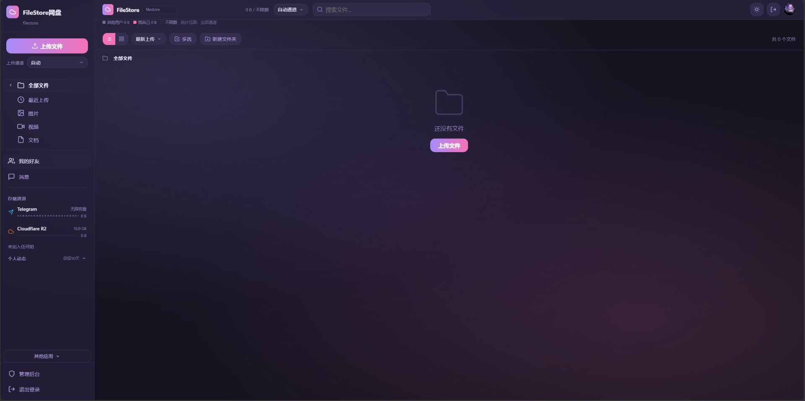

<p align="center">
  
</p>

<h1 align="center">FileStore 网盘</h1>

<p align="center">
  基于 Cloudflare Pages 的免费自建网盘 · 无需 VPS · 永久免费 · 多通道无限存储
</p>

<p align="center">
  <a href="#-功能特性">功能特性</a> ·
  <a href="#-部署指南">部署指南</a> ·
  <a href="#-截图">截图</a> ·
  <a href="#-技术栈">技术栈</a> ·
  <a href="#-赞赏">赞赏</a>
</p>

<p align="center">
  <sub><i>🌍 语言 / Language: <b>中文</b> | <a href="#english-version">English</a></i></sub>
</p>

---

<p align="center">
  
</p>

---

## 🌟 项目简介

FileStore 是一个基于 **Cloudflare Pages** 搭建的免费自建网盘。无需购买 VPS，利用 Cloudflare 免费额度 + Telegram / Cloudflare R2 / S3 / Discord / HuggingFace / WebDAV 等多个存储通道，实现 **近乎无限的存储空间**。

### 为什么选择 FileStore？

- **完全免费** — 无需 VPS，Cloudflare Pages 免费托管
- **无限存储** — 多通道组合，Telegram 通道无容量上限
- **多用户** — 支持多用户注册，每个用户独立存储空间
- **组共享** — 创建组，组内成员共享文件
- **好友系统** — 添加好友，私聊发送文件
- **文件分享** — 生成分享链接，支持提取码和有效期
- **管理后台** — 完整的管理面板，用户/通道/配额一站管理
- **手机适配** — 完美适配手机端，随时随地管理文件

## ✨ 功能特性

| 功能 | 说明 |
|------|------|
| 📤 多通道上传 | Telegram / R2 / S3 / Discord / HuggingFace / WebDAV |
| 👥 多用户系统 | 用户名登录，独立存储配额 |
| 🏠 组共享网盘 | 创建组、加入组、组内共享文件 |
| 💬 好友私聊 | 搜索用户、添加好友、实时聊天 |
| 🔗 文件分享 | 提取码 + 有效期 + 浏览/下载统计 |
| 📁 文件夹管理 | 多级文件夹、拖拽移动、批量操作 |
| 🎨 深色/浅色主题 | 自动跟随系统或手动切换 |
| 📱 手机适配 | 完整移动端支持 |
| 🔍 在线预览 | 图片/视频/音频/文本在线预览 |
| 📊 操作日志 | 90 天操作记录，全链路追踪 |
| 🔐 管理后台 | 用户管理、通道配置、系统设置 |

## 🚀 部署指南

### 前置条件

- [Cloudflare 账号](https://dash.cloudflare.com/)（免费即可）
- [GitHub 账号](https://github.com/)
- 至少一个存储通道的账号（推荐 Telegram Bot）

### 快速部署

1. **Fork 本仓库** 或 **上传代码到你的 GitHub**

2. **登录 [Cloudflare Dashboard](https://dash.cloudflare.com/)**
   - 进入 Pages → Create a project → Connect to Git
   - 选择你 Fork 的仓库
   - 构建设置：
     - **Build command:** `npm install`
     - **Build output directory:** `frontend-dist`
     - **Node.js version:** `18` 或 `20`

3. **配置环境变量**（在 Pages 项目的 Settings → Environment variables）
   ```
   # Telegram 通道（可选）
   TG_BOT_TOKEN=你的Telegram Bot Token
   TG_CHAT_ID=你的Telegram Chat ID

   # Cloudflare R2（可选）
   R2_ACCOUNT_ID=你的Cloudflare Account ID
   R2_ACCESS_KEY_ID=你的R2 Access Key
   R2_SECRET_ACCESS_KEY=你的R2 Secret Key
   R2_BUCKET_NAME=你的R2 Bucket名称

   # 管理员密码（首次部署后设置）
   ADMIN_PASSWORD=你想要的管理员密码
   ```

4. **部署完成** — Cloudflare 会自动构建并部署，等待 1-2 分钟即可访问

### 首次登录

- 访问你的 Pages 域名
- 输入任意用户名即可进入（无需密码）
- 管理后台：访问 `/admin.html`，使用管理员密码登录

## 📸 截图

<p align="center">
  
</p>

## 🛠 技术栈

- **前端:** 原生 HTML/CSS/JavaScript（零框架依赖，单文件架构）
- **后端:** Cloudflare Pages Functions（边缘计算）
- **数据库:** Cloudflare D1（SQLite）
- **存储:** Cloudflare R2 / Telegram Bot API / S3 / Discord / HuggingFace / WebDAV
- **部署:** Cloudflare Pages（免费托管）

## 📂 项目结构

```
FileStore/
├── frontend-dist/          # 前端文件
│   ├── index.html          # 网盘主页面
│   └── admin.html          # 管理后台
├── functions/              # 后端 API（Pages Functions）
│   ├── api/                # API 路由
│   │   ├── auth/           # 登录认证
│   │   ├── manage/         # 管理后台 API
│   │   ├── groups/         # 组系统 API
│   │   ├── friends/        # 好友系统 API
│   │   ├── chat/           # 私聊 API
│   │   └── ...
│   ├── upload/             # 文件上传处理
│   └── utils/              # 工具函数
├── database/               # 数据库迁移脚本
│   └── migrations/
├── package.json
├── LICENSE                 # MIT License
└── _routes.json
```

## 🤝 贡献

欢迎提交 Issue 和 Pull Request！

1. Fork 本仓库
2. 创建你的特性分支 (`git checkout -b feature/AmazingFeature`)
3. 提交你的更改 (`git commit -m 'Add some AmazingFeature'`)
4. 推送到分支 (`git push origin feature/AmazingFeature`)
5. 打开一个 Pull Request

## 📄 License

本项目基于 [MIT License](LICENSE) 开源。

## 💰 觉得好的话可以点击下边的微信赞赏码给偶打点钱喵~

<p align="center">
  
</p>

<p align="center">谢谢泥喵~ 😺</p>

---

<p align="center">
  如果这个项目对你有帮助，欢迎给个 ⭐ Star 支持一下！
</p>

---

<a id="english-version"></a>

# 🌍 English Version

<p align="center">
  <sub><i>Language: <a href="#">中文</a> | <b>English</b></i></sub>
</p>

## 🌟 Introduction

FileStore is a **free self-hosted cloud storage** solution built on **Cloudflare Pages**. No VPS required. Forever free. Powered by multiple storage channels (Telegram, R2, S3, Discord, HuggingFace, WebDAV) for **near-infinite storage space**.

### Why FileStore?

- **Completely Free** — No VPS needed, hosted on Cloudflare Pages free tier
- **Infinite Storage** — Multi-channel combo, Telegram channel has no size limit
- **Multi-User** — User registration with independent storage quotas
- **Group Sharing** — Create groups, share files among group members
- **Friend System** — Add friends, private chat, send files
- **File Sharing** — Share links with optional passcode and expiration
- **Admin Panel** — Full management dashboard for users, channels, and settings
- **Mobile Friendly** — Fully responsive design for mobile devices

## ✨ Features

| Feature | Description |
|---------|-------------|
| 📤 Multi-Channel Upload | Telegram / R2 / S3 / Discord / HuggingFace / WebDAV |
| 👥 Multi-User System | Username login, independent storage quotas |
| 🏠 Group Sharing | Create/join groups, share files within groups |
| 💬 Private Chat | Search users, add friends, real-time messaging |
| 🔗 File Sharing | Passcode + expiration + view/download stats |
| 📁 Folder Management | Multi-level folders, drag & drop, batch operations |
| 🎨 Dark/Light Theme | Auto-follow system or manual toggle |
| 📱 Mobile Support | Full mobile responsiveness |
| 🔍 Online Preview | Image/video/audio/text preview |
| 📊 Activity Logs | 90-day operation history |
| 🔐 Admin Panel | User management, channel config, system settings |

## 🚀 Deployment Guide

### Prerequisites

- [Cloudflare Account](https://dash.cloudflare.com/) (free tier works)
- [GitHub Account](https://github.com/)
- At least one storage channel account (Telegram Bot recommended)

### Quick Deploy

1. **Fork this repo** or **upload code to your GitHub**

2. **Login to [Cloudflare Dashboard](https://dash.cloudflare.com/)**
   - Go to Pages → Create a project → Connect to Git
   - Select your forked repo
   - Build settings:
     - **Build command:** `npm install`
     - **Build output directory:** `frontend-dist`
     - **Node.js version:** `18` or `20`

3. **Configure Environment Variables** (in Pages project Settings → Environment variables)
   ```
   # Telegram Channel (optional)
   TG_BOT_TOKEN=your_telegram_bot_token
   TG_CHAT_ID=your_telegram_chat_id

   # Cloudflare R2 (optional)
   R2_ACCOUNT_ID=your_cloudflare_account_id
   R2_ACCESS_KEY_ID=your_r2_access_key
   R2_SECRET_ACCESS_KEY=your_r2_secret_key
   R2_BUCKET_NAME=your_r2_bucket_name

   # Admin Password (set after first deployment)
   ADMIN_PASSWORD=your_desired_admin_password
   ```

4. **Done** — Cloudflare will auto-build and deploy. Wait 1-2 minutes.

### First Login

- Visit your Pages domain
- Enter any username to enter (no password needed)
- Admin panel: visit `/admin.html`, login with admin password

## 📸 Screenshot

<p align="center">
  
</p>

## 🛠 Tech Stack

- **Frontend:** Vanilla HTML/CSS/JavaScript (zero framework dependency)
- **Backend:** Cloudflare Pages Functions (edge computing)
- **Database:** Cloudflare D1 (SQLite)
- **Storage:** Cloudflare R2 / Telegram Bot API / S3 / Discord / HuggingFace / WebDAV
- **Hosting:** Cloudflare Pages (free)

## 📂 Project Structure

```
FileStore/
├── frontend-dist/          # Frontend files
│   ├── index.html          # Main page
│   └── admin.html          # Admin panel
├── functions/              # Backend API (Pages Functions)
│   ├── api/                # API routes
│   │   ├── auth/           # Authentication
│   │   ├── manage/         # Admin API
│   │   ├── groups/         # Group system API
│   │   ├── friends/        # Friend system API
│   │   ├── chat/           # Private chat API
│   │   └── ...
│   ├── upload/             # Upload processing
│   └── utils/              # Utility functions
├── database/               # Database migrations
│   └── migrations/
├── package.json
├── LICENSE                 # MIT License
└── _routes.json
```

## 🤝 Contributing

Issues and Pull Requests are welcome!

1. Fork the repo
2. Create your feature branch (`git checkout -b feature/AmazingFeature`)
3. Commit changes (`git commit -m 'Add some AmazingFeature'`)
4. Push to branch (`git push origin feature/AmazingFeature`)
5. Open a Pull Request

## 📄 License

This project is licensed under the [MIT License](LICENSE).

## 💰 Support

If you find this project helpful, consider buying me a coffee!

<p align="center">
  
</p>

<p align="center">Thank you! 😺</p>

---

<p align="center">
  If this project helps you, please give it a ⭐ Star!
</p>
